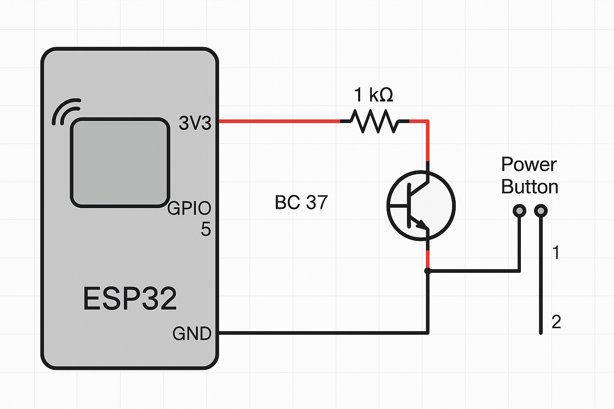

# ESP32 PC Power Control via Alexa (Sinric Pro)

Este projeto permite **ligar o seu computador** remotamente via **ESP32 integrado com a Alexa**, utilizando um **transistor BC337** como chave eletrônica que simula o botão Power da placa-mãe.

## 🛠️ Componentes utilizados

- ESP32 com conexão Wi-Fi
- Transistor NPN **BC337**
- Resistor 1kΩ (limitador de corrente na base do transistor)
- Jumpers para conexão
- Conector do botão Power da placa-mãe (2 pinos)

## 🔌 Esquema eletrônico

1. **GPIO D5 da ESP32** → Resistor 1kΩ → **Base do transistor BC337**
2. **Coletor do BC337** → Um pino do botão Power (lado positivo)
3. **Emissor do BC337** → GND da ESP32 + outro pino do botão Power (lado negativo)
4. ESP32 e placa-mãe devem **compartilhar GND**

## 🖼️ Esquema Eletrônico



## 🌐 Integração com Alexa via Sinric Pro

1. Crie uma conta no [Sinric Pro](https://portal.sinric.pro)
2. Cadastre um novo dispositivo do tipo **Switch**
3. Copie as seguintes credenciais para seu código:

```cpp
#define WIFI_SSID     "SUA_REDE_WIFI"
#define WIFI_PASS     "SENHA_WIFI"
#define APP_KEY       "SINRICPRO_APP_KEY"
#define APP_SECRET    "SINRICPRO_APP_SECRET"
#define DEVICE_ID     "SINRICPRO_DEVICE_ID"
```

4. Instale a biblioteca **SinricPro** pela IDE do Arduino
5. Compile e envie o código para o ESP32
6. Na Alexa, adicione o dispositivo Sinric Pro e use o comando: **"Alexa, ligar computador"** 🔊💻

## ✅ Funcionamento

Quando a Alexa envia o comando, a ESP32 aciona o transistor BC337 por 500ms, fechando o circuito do botão Power e ligando o PC exatamente como um toque físico no botão.

## ⚠️ Aviso
- Certifique-se de que a **fonte do seu PC esteja ligada na tomada**.
- A ESP32 deve **permanecer alimentada** por fonte externa ou USB.
- **Não inverta os fios do botão Power** — sempre teste com multímetro se tiver dúvida.

---

Feito com ❤️ por [Seu Nome Aqui] — baseado no suporte do ChatGPT.
