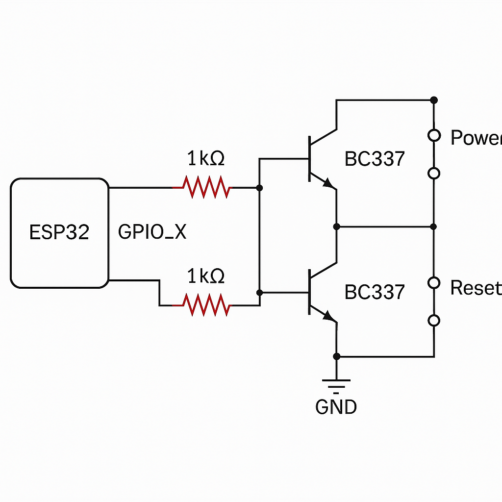

# ESP32 Power On PC via Alexa

Controle seu computador remotamente utilizando um ESP32 integrado à Alexa (via Sinric Pro). Acione o botão Power — e opcionalmente o botão Reset — por comando de voz.

## Esquemas do Circuito

### Circuito com Botão Power e Reset

Figura: Esquema com controle do botão Power (GPIO 2) e Reset (GPIO 4).

---

## ⚙️ Visão Geral

- 🔌 Aciona o botão Power da placa-mãe via transistor
- 📶 Integração com Alexa usando Sinric Pro (plano gratuito)
- 🧠 Código simples com suporte a múltiplos GPIOs

---

## 📦 Materiais Necessários

- ESP32 com USB
- 2x Transistores BC337
- 2x Resistores 1kΩ
- Jumpers
- Conector do botão Power e Reset da placa-mãe

---

## 🔧 Esquema do Circuito

O circuito utiliza dois transistores para simular os botões Power e Reset:

- GPIO 5 → Power Switch
- GPIO 4 → Reset Switch

Cada GPIO:
- Passa por um resistor de 1kΩ
- Conecta à base do BC337
- Emissor do BC337 → GND
- Coletor do BC337 → pino do botão na placa-mãe (PWR ou RESET)

A imagem acima mostra essa ligação de forma clara.

---

## 🧠 Como Funciona

- O ESP32 recebe o comando da Alexa via Sinric Pro
- Ele ativa brevemente o GPIO, que aciona o transistor
- O transistor fecha o circuito momentaneamente (simulando o botão)
- O PC liga ou reinicia

O botão físico da placa continua funcionando normalmente, pois o controle está em paralelo.

---

## 📘 Documentação

- [🛠️ Montagem Passo a Passo](https://github.com/allan-nex/allan-nex-esp32_poweron_pc/wiki/🛠️-Montagem-Passo-a-Passo)
- [🔌 Integração com Sinric Pro e Alexa](https://github.com/allan-nex/allan-nex-esp32_poweron_pc/wiki/🔌-Integração-com-Sinric-Pro-e-Alexa)
- [📚 Como funciona o circuito](https://github.com/allan-nex/allan-nex-esp32_poweron_pc/wiki/📚-Como-funciona-o-circuito)
- [✨ Possíveis melhorias](https://github.com/allan-nex/allan-nex-esp32_poweron_pc/wiki/✨-Possíveis-melhorias)

---

## 🚀 Licença

Este projeto é de uso livre sob a licença MIT.

